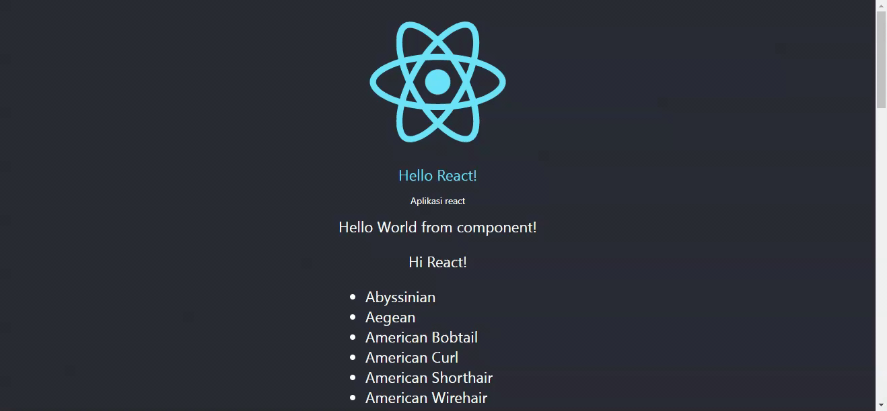

# Materi React

- [React](#react)
  - [Tahapan untuk memulai menggunakan React](#tahapan-untuk-memulai-menggunakan-react)
- [React Component](#react-component)
  - [Contoh JSX pada komponen tampilan utama `App`](#contoh-jsx-pada-komponen-tampilan-utama-app)
    - [Pada JSX:](#pada-jsx)
  - [Membuat dan memakai komponen](#membuat-dan-memakai-komponen)
  - [React props](#react-props)
- [React Hook useState](#react-hook-usestate)
  - [Cara memakai state menggunakan useState](#cara-memakai-state-menggunakan-usestate)
- [Axios](#axios)
- [React Hook useEffect](#react-hook-useeffect)
- [React Router](#react-router)
  - [Memakai react router](#memakai-react-router)

# React

- React adalah library UI buatan Facebook yang digunakan untuk membuat User Interface pada web.
- React membagi komponen - komponen tampilan menjadi bagian kecil (Modular)
- React menggunakan `Virtual DOM` dalam melakukan proses render tampilan komponen, perubahan state, menyematkan props dsb.
- React akan mengubah DOM browser / tampilan asli setelah melakukan perbandingan perubahan antara `Virtual DOM` dengan `DOM`.
- React hanya akan mengubah perbedaannya saja sehingga tidak perlu memuat ulang seluruh tampilan DOM.

## Tahapan untuk memulai menggunakan React

1. Menginstall Node JS, [download here](https://nodejs.org/en/download/)
2. Buat aplikasi react baru dengan `create-react-app`

```sh
npx create-react-app nama-applikasi
```

Tunggu hingga perintah selesai dan sukses dijalankan.

Selanjutnya berikut ini struktur file pada aplikasi react yang telah dibuat.


Direktori src adalah tempat utama untuk membuat aplikasi react.

3. Jalankan development server

```sh
npm start
```

# React Component

Pada React kita menggunakan bahasa JSX yaitu bahasa yang simpelnya adalah gabungan antara HTML dengan JavaScript

## Contoh JSX pada komponen tampilan utama `App`

- Kode JSX pada komponen App


- Tampilan

  

### Pada JSX:

- Dapat mengembalikan elemen HTML

  ```jsx
  return (
    <div>
      <p>Aplikasi</p>
    </div>
  );
  ```

- Dapat memasukkan kode js atau menyematkan variabel langsung ke dalam elemen HTML dengan dibungkus simbol kurawal

  ```jsx
  <div className="App-link">{1 + 1}</div>
  ```

  ```jsx
  <div className="App-link">{teks}</div>
  ```

- Menggunakan konsep import ekspor

  - Impor bisa digunakan untuk memuat gambar, css atau js dan sebaliknya juga untuk ekspor.
  - Pada ekspor harus menggunakan keyword `default` disusul nama fungsi komponennya.

  ```jsx
  import logo from './logo.svg'
  import './App.css'
  ...
  export default App
  ```

- Eksternal CSS style

  Untuk memasukkan _class_ CSS menggunakan atribut `className` (**bukan class**)

  ```jsx
  ...
  <div className='App-header'>
  ...
  ```

- Inline CSS style

  Untuk melakukan _inline styling_ maka menggunakan atribut _style_ dengan nilai `object`, `object` tersebut berisi properti _style_ CSS namun dengan penamaan `camelCase`

  

## Membuat dan memakai komponen

Terdapat 2 jenis pembuatan komponen, yaitu komponen class dan komponen fungsi

- Komponen fungsi

  

- Komponen class

  

Namun direkomendasikan untuk menggunakan tipe komponen fungsi karena lebih simpel

- Membuat komponen HelloWorld

  

  - Disarankan agar penamaan file dan juga komponen menggunakan `PascalCase`

    

- Memakai komponen HelloWorld

  - Impor komponen HelloWorld

  ```jsx
  import HelloWorld from "./HelloWorld";
  ```

  - Untuk memakai tinggal memanggil nama komponen dengan sintaks HTML

  ```jsx
  <HelloWorld />
  ```

- Tampilan kode setelah memakai komponen HelloWorld

  

- Tampilan pada browser

  

- Direkomendasikan agar seluruh komponen dimasukkan kedalam direktori baru bernama `components` agar struktur lebih rapi

  

  - Jangan lupa sesuaikan impor
    

## React props

Kita dapat menyematkan/passing variabel kepada komponen lain menggunakan props.

- Ubah HelloWorld

  - Beri parameter objek dan `destructure` properti object

  ```jsx
  ...
  function HelloWorld({ sayTo }) {...}
  ...
  ```

  - Pakai properti

  ```jsx
  <p>Hi {sayTo}!</p>
  ```

  - Atur properti `defaultProps` pada komponen (Opsional)

  ```jsx
  HelloWorld.defaultProps = {
    sayTo: "React",
  };
  ```

  

- Pakai prop yang dibuat pada App

  

- Tampilan dengan props

  

# React Hook useState

Hook adalah fitur react yang memudahkan penggunaan state dan bagian lifecycle react lainnya

State adalah data atau variabel pada react yang perubahan nilainya akan sinkron dengan perubahan tampilan pada komponen terkait. Sederhannya saat variabel state berubah maka react akan merender ulang komponen yang terkait sesuai dengan data state yang terbaru.

## Cara memakai state menggunakan useState

Untuk memakai state maka kita perlu mengimpor hook `useState` dan menginisialisasi nama state, fungsi set-nya dan mengisi nilai awal state-nya. Fungsi set dipakai untuk mengubah nilai state.

- Impor useState dari react

  ```jsx
  import { useState } from "react";
  ```

- Buat variable state

  ```jsx
  const [teks, setTeks] = useState("suatu teks");
  ```

- Tes perubahan state menggunakan onCLick

  - Kode

  

  - Tampilan

  

# Axios

Axios adalah modul HTTP client yang memiliki banyak fitur dan menurunkan jumlah baris kode dibandingkan _built-in_ `fetch`.

Dengan `fetch`

```js
const response = await fetch(url);
const json = await response.json();
console.log(json);
```

Dengan `axios`

```js
const response = await axios.get(url);
console.log(response.data);
```

Pasang dengan npm

```sh
npm i axios
```

Impor ke js

```js
import axios from "axios";
```

# React Hook useEffect

Hook useEffect dapat dipakai untuk mengakses fitur componentDidMount, componentDidUpdate dan componentDidUnmount yang mana hanya terdapat pada tipe komponen class

Hook useEffect biasanya dipakai untuk melakukan proses di awal waktu contohnya mengambil data dari API

- Impor useEffect dan axios

  ```js
  import { useState, useEffect } from "react";
  import axios from "axios";
  ```

- Buat state & pakai useEffect

  ```js
  const [cats, setCats] = useState([]);

  useEffect(() => {
    const getCats = async () => {
      const response = await axios.get("https://api.thecatapi.com/v1/breeds");
      setCats(response.data);
    };

    getCats();
  }, []);
  ```

- Lakukan mapping setelah data termuat

  ```jsx
  return (
    <div>
      <div>Hello World from component!</div>
      <p>Hi {sayTo}!</p>
      {cats.length === 0 ? (
        <p>Loading...</p>
      ) : (
        <ul style={{ textAlign: "left" }}>
          {cats.map((item, idx) => (
            <li key={idx}>{item.name}</li>
          ))}
        </ul>
      )}
    </div>
  );
  ```

- Tampilan di browser

  

- Simplenya useEffect untuk menjalankan method pas komponen dimuat/baru ditampilkan

  ```js
    useEffect(method, [])
  ```

# React Router

Pada create-react-app aplikasi react tidak termasuk/memiliki routing halaman solusinya dengan memakai react router

- Install react router

```sh
npm install react-router-dom@6
```

## Memakai react router

Untuk mamakai router maka komponen aplikasi harus dibungkus komponen `BrowserRouter`

```jsx
function App() {
  return (
    <BrowserRouter>
      <div className="App">...</div>
    </BrowserRouter>
  );
}
```

- Jangan lupa impor

```js
import { BrowserRouter } from "react-router-dom";
```

Buat komponen halaman `Home.js` di direktori `components`

```jsx
function Home() {
  return <div>Ini Home</div>;
}

export default Home;
```

Buat komponen halaman `Profile.js` di direktori `components`

```jsx
function Profile() {
  return <div>Ini Profile</div>;
}

export default Profile;
```

Impor komponen halaman

```js
import Home from "./components/Home";
import Profile from "./components/Profile";
```

Untuk membuat rute memakai komponen `Route` yang dibungkus dengan `Routes`

```jsx
function App() {
  return (
    <BrowserRouter>
      <div className="App">
        <Routes>
          <Route path='/' element={<Home />} />
          <Route path='profile' element={<Profile />} />
        </Routes>
      </div>
    </BrowserRouter>
  )
}
```

- Tambahkan impor `Routes` dan `Route`

```js
import { BrowserRouter, Routes, Route } from "react-router-dom";
```

- Agar dapat melakukan perpindahan halaman dengan mudah maka bisa dengan membuat komponen navigasi

```jsx
function App() {
  return (
    <BrowserRouter>
      <div className="App">
        <nav>
          <Link to='/' className='App-link'>Home </Link>
          <Link to='profile' className='App-link'>Profile </Link>
        <nav>
        <Routes>
          <Route path='/' element={<Home />} />
          <Route path='profile' element={<Profile />} />
        </Routes>
      </div>
    </BrowserRouter>
  )
}
```

- Tambahkan impor `Link`

```js
import { BrowserRouter, Routes, Route, Link } from "react-router-dom";
```

- Tampilan di browser
  

# Sekian Terima Kasih
