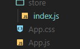
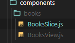
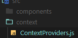

# Daftar Isi

- [React State Management](#react-state-management)
- [State Management dengan Redux Toolkit (RTK)](#state-management-dengan-redux-toolkit-rtk)
  - [Memulai project dengan Redux](#memulai-project-dengan-redux)
- [Redux Middleware](#redux-middleware)
  - [Tahapan menggunakan redux middleware](#tahapan-menggunakan-redux-middleware)
- [React Context](#react-context)
  - [Tahapan menggunakan context](#tahapan-menggunakan-context)
- [React Testing](#react-testing)
  - [Tahapan testing menggunakan `Jest`](#tahapan-testing-menggunakan-jest)

# React State Management

`State Management` adalah pengelolaan _state_ pada React.

- Berguna agar _state_ dapat digunakan/diakses dari komponen anak.
- Menghindari _props drilling_ atau mem-passing prop melalui komponen anak yang berada di antara komponen sumber dan tujuan

# State Management dengan Redux Toolkit (RTK)

Redux is global state container (store):

- pada Redux hanya terdapat 1 object **_store_** yang berisi semua state

Redux is predictable:

- tidak akan berubah bila tidak diubah dengan _action_ yg telah ditentukan
- perubahan _state_ menjadi konsisten sesuai dengan proses yg ada pada _action_

Prinsip Redux

1. _State_ pada _store_ itu _read-only_. Hanya _reducer_ yang boleh memodifikasi
2. Untuk melakukan sesuatu/mengubah _state_ harus dengan _action_
3. _Reducer_ adalah bagian yang boleh memodifikasi _state_ pada _store_

Flow data pada redux

1. _User_ melakukan _action_ (_dispatch_)
2. _Reducer_ memvalidasi _action_
3. _Reducer_ mengakses **_store_**
4. _Reducer_ mengembalikan hasil _state_

## Memulai project dengan Redux

Contoh kasus _state_ `books`:

1. Install redux dependencies

   ```sh
   npm install react-redux @reduxjs/toolkit axios
   ```

2. Membuat direktori `store` lalu `index.js` lalu membuat store

   `File: store/index.js`

   

   ```js
   import { configureStore } from "@reduxjs/toolkit";

   const store = configureStore({
     reducer: {},
   });

   export default store;
   ```

3. Mengimpor `store` di `index.jx`

   `File: index.js`

   ```jsx
   import { Provider } from "react-redux";
   import store from "./store";
   ```

4. Kemudian bungkus `App` dengan `Provider`

   ```js
   <Provider store={store}>
     <App />
   </Provider>
   ```

5. Membuat _Slice_

   `File: components/books/BooksSlice.js`

   

   ```jsx
   import { createSlice } from "@reduxjs/toolkit";

   const initialState = {
     totalBooks: 100,
     totalAuthors: 48,
   };

   const bookSlice = createSlice({
     name: "books",
     initialState,
     // reducers
     reducers: {
       // nama action: fungsi
       borrow: function (state) {
         // dapat langsung mengubah state
         // seperti variabel mutable
         state.totalBooks -= 1;
         // dilarang melakukan return state (hanya mengubah)
       },
     },
   });

   export default bookSlice.reducer;
   export const { borrow } = bookSlice.actions;
   ```

6. Memasukkan _reducer_ _books_ ke _store_

   `File: store/index.js`

   ```js
   import { configureStore } from "@reduxjs/toolkit";
   // booksslice adalah reducer untuk state books
   import bookReducer from "../components/books/BooksSlice";

   const store = configureStore({
     reducer: {
       // nama state: objek reducer
       books: bookReducer,
     },
   });

   export default store;
   ```

7. Membuat _View_ atau komponen tampilan. Memakai `useSelector` untuk mengarah ke `state` tujuan dan `useDispacth` untuk melakukan `action`

   `File: components/books/BooksSlice.js`

   ```jsx
   import { useSelector, useDispatch } from "react-redux";
   import { borrow } from "./BooksSlice";

   function BooksView() {
     // membuat fungsi dispatch
     const dispatch = useDispatch();
      // memilih state
     const books = useSelector((state) => state.books);

     return (
       <div>
         <h1>BooksView</h1>
         <p>Total books: {books.totalBooks}</p>
         <p>Total authors: {books.totalAuthors}</p>

         {* menjalankan action dengan dispatch saat tombol klik *}
         <button onClick={() => dispatch(borrow())}>Borrow 1 book</button>
       </div>
     );
   }

   export default BooksView;
   ```

8. Pakai _View_ di `App.js`

   `File: App.js`

   ```js
   ...
   import BooksView from "./components/books/BooksView";
   ...
   function App() {
     return (
       <div className="App">
         <BooksView />
       </div>
     )
   }
   ...
   ```

# Redux Middleware

`Redux Middleware` adalah fungsi/aplikasi yang dijalankan setelah `dispatch`, sebelum `action` menuju `reducer`.

- Redux middleware biasanya dipakai untuk keperluan mengolah data API yang diperlukan `action` sebeulum menuju `reducer`.
- Redux middleware ada karena penggunaan `reducer` hanya boleh melakukan modifikasi `state` saja tidak boleh terdapat proses lain seperti menggambil data API.

## Tahapan menggunakan redux middleware

Contoh kasus _state_ `users`

`File: components/users/UsersSlice.js`

1. Membuat _Slice_

   `File: components/users/UsersSlice.js`

2. Mengimport modul `createAsyncThunk` dan `axios`

   ```js
   import { createSlice, createAsyncThunk } from "@reduxjs/toolkit";
   import axios from "axios";
   ```

3. Membuat fungsi `initialState` yang berisi data awal `state`

   ```js
   const initialState = {
     isLoading: false,
     data: [],
     error: "",
   };
   ```

4. Membuat dan mengekspor fungsi `thunk`

   - Nama pertama alamat atau path di `typePrefix` samakan saja dengan nama `state` kemudian nama fungsinya
   - `typePrefix` dipakai untuk membuat konstanta `type` pada action

   ```js
   // createAsynThunk(typePrefix, function)
   export const fetchUsers = createAsyncThunk("users/fetchUsers", () =>
     /* kembalian response data dengan axios */
     axios.get("https://jsonplaceholder.typicode.com/users").then((res) => res.data)
   );
   ```

5. Membuat slice dengan properti `extraReducers`

   Pada middleware dengan fungsi async perlu membuat 3 kondisi sesuai pada `Promise` yaitu, `pending`, `rejected` dan `fulfilled`

   ```js
   const usersSlice = createSlice({
     /* nama state */
     name: "users",
     /* data state awal */
     initialState,
     /* untuk bentuk fungsi pakai extraReducer*/
     extraReducers: function (builder) {
       /* saat pending */
       builder.addCase(fetchUsers.pending, function (state) {
         state.isLoading = true;
       });

       /* saat gagal*/
       builder.addCase(fetchUsers.rejected, function (state, action) {
         state.isLoading = false;
         // state.users = []
         state.error = action.error;
       });

       /* saat selesai */
       builder.addCase(fetchUsers.fulfilled, function (state, action) {
         state.isLoading = false;
         /* data yang didapatkan dari fetchUsers berada pada properti `payload` */
         state.data = action.payload;
       });
     },
   });

   // ekspor objek reducer
   export default usersSlice.reducer;
   ```

6. Menambahkan _reducer_ ke _store_

   `File: store/index.js`

   ```js
   ...
   // impor reducer
   import usersReducer from '../components/users/UsersSlice'

   const store = configureStore({
     reducer: {
       // nama state: objek reducer
       users: usersReducer,
     },
   })
   ...
   ```

7. Membuat _View_

   `File: components/users/UsersView.js`

8. Mengimpor

   - `useEffect` untuk melakukan proses saat komponen dimuat
   - `useSelector` untuk memilih _state_
   - `useDispatch` untuk melakukan _action_
   - `fetchUsers` objek `action` yang diperlukan

   ```js
   import { useEffect } from "react";
   import { useSelector, useDispatch } from "react-redux";
   import { fetchUsers } from "./UsersSlice";
   ```

9. Komponen _View_

   ```jsx
   function UsersView() {
     const dispatch = useDispatch();
     const users = useSelector((state) => state.users);

     useEffect(function () {
       dispatch(fetchUsers());
     }, []);

     return (
       <div>
         <h1>Users</h1>
         {/* tampilkan loading bila data belum diterima/diunduh */}
         {users.isLoading ? (
           <h1>Loading...</h1>
         ) : users.error !== "" ? (
           /* tampilkan error bila data error */
           <h1>{users.error}</h1>
         ) : (
           /* tampilkan data users */
           <ul style={{ textAlign: "left" }}>
             {users.data.map((item, idx) => (
               <li key={idx}>{item.name}</li>
             ))}
           </ul>
         )}
       </div>
     );
   }

   export default UsersView;
   ```

10. Pakai _View_ di `App.js`

    `File: App.js`

    ```js
    ...
    import UsersView from './components/users/UsersView';
    ...
    function App() {
      return (
        <div className="App">
          <UsersView />
        </div>
      )
    }
    ...
    ```

# React Context

`React Context` adalah cara lain untuk menghindari _props drilling_. Dengan _react context_ kita tidak memerlukan _dependency_ lain karena fitur ini sudah _built-in_ di react

## Tahapan menggunakan context

1.  Membuat _Context Providers_

    `File: context/ContextProviders.js`

    

    ```js
    import React from "react";

    export default function ContextProviders({ providers, children }) {
      const renderProvider = (providers, children) => {
        const [provider, ...theRestProviders] = providers;

        if (provider) {
          return React.cloneElement(provider, null, renderProvider(theRestProviders, children));
        }
        return children;
      };

      return renderProvider(providers, children);
    }
    ```

2.  Membuat _context_

    Contoh kasus:

    - _state user_ berisi objek user
    - _state userData_ berisi array user dari API

    `File: context/UserContext.js`

3.  Impor modul

    - `useState` untuk _state_
    - `useEffect` untuk tempat proses pengambilan data dari API
    - `createContext` untuk membuat _context_
    - `axios` untuk pengambilan data dari API

    ```js
    import { useState, useEffect, createContext } from "react";
    import axios from "axios";
    ```

4.  Buat dan ekspor `UserContext` dengan modul `createContext`

    ```js
    export const UserContext = createContext();
    ```

5.  Buat dan ekspor `UserContextProvider`

    ```jsx
    const UserContextProvider = (props) => {
      const [user] = useState({
        name: "Student",
        batch: "Joyful Jasper",
      });

      const [userData, setUserData] = useState([]);

      useEffect(() => {
        const getData = async () => {
          const res = await axios.get("https://jsonplaceholder.typicode.com/users");
          const data = res.data;
          setUserData(data);
        };

        getData();
      }, []);

      return (
        /* masukkan state ke value */
        <UserContext.Provider value={{ user, userData }}>
          {/* atau bisa masukkan state langsung jika hanya satu */}
          {/* <UserContext.Provider value={ user }> */}
          {props.children}
        </UserContext.Provider>
      );
    };

    // ekspor default
    export default UserContextProvider;
    ```

6.  Terdapat 2 cara untuk mengakses _context_ yaitu dengan menggunakan `Consumer` dan `useContext`.

    - Jika memakai `useContext` kita bisa mengakses _state_ dari _context_ dengan lebih simpel.
    - Untuk _state_ `user` kita coba dengan cara pertama.
    - Untuk _state_ `userData` kita coba dengan `useContext`.

    Dengan `Consumer`:

    - Buat komponen _consumer_ yang akan menggunakan _context_

      `File: components/User.js`

    - Impor `UserContext`

      ```jsx
      import { UserContext } from "../context/UserContext";

      const User = () => (
        <UserContext.Consumer>
          {(context) => {
            /* jika memasukkan object of state pada value maka di-destructure untuk mengambil state user */
            const { user } = context;
            /* jika tidak maka langsung pakai context atau ubah nama argumen sesuai nama state */
            /* {(user) => {} */

            return (
              <div>
                <h1>Halaman User</h1>
                <p>{user.name}</p>
                <p>{user.batch}</p>
              </div>
            );
          }}
        </UserContext.Consumer>
      );

      export default User;
      ```

    Dengan `useContext`:

    - Buat komponen _consumer_ yang akan menggunakan _context_

      `File: components/Users.js`

    - Impor modul `useContext` dan `UserContext`

      ```js
      import { useContext } from "react";
      import { UserContext } from "../context/UserContext";
      ```

    - Buat dan ekspor komponen _consumer_

      ```jsx
      const Users = () => {
        const { userData } = useContext(UserContext);

        return (
          <div>
            <h1>Halaman Users (useContext)</h1>
            {userData.length === 0 ? <p>Loading...</p> : userData.map((item) => <p>{item.name}</p>)}
          </div>
        );
      };

      export default Users;
      ```

7.  Muat _provider_ dan komponen _consumer_ di `App.js`

    `File: App.js`

    ```jsx
    // consumer dengan createContext
    import User from "./components/User";
    import Users from "./components/Users";
    // Provider untuk UserContext
    import UserContextProvider from "./context/UserContext";

    function App() {
      return (
        <div className="App">
          {/* taruh komponen consumer sebagai anak dari provider UserContext */}
          <UserContextProvider>
            <User />
            <Users />
          </UserContextProvider>
        </div>
      );
    }

    export default App;
    ```

# React Testing

`React Testing` digunakan untuk melakukan uji coba pada kode proyek react yang kita buat. _Testing_ berguna untuk melihat apakah kode yang dibuat berjalan sesuai spek atau tidak.

Kali ini kita menggunakan `Jest` untuk melakukan _testing_ karena `Jest` sudah otomatis terpasang jika menggunakan `create-react-app` saat membuat proyek react baru.

## Tahapan testing menggunakan `Jest`

Untuk melakukan _testing_ maka perlu membuat file yang berisi kode _testing_. Pada `jest`, standar penamaan berkas adalah memberi `test` sebelum ekstensi berkas, misal `Home.test.js`.

Untuk kali ini kita coba _testing_ aplikasi `Counter`

1. Membuat komponen `Counter`

   ```jsx
   import { useState } from "react";

   export default function Counter({ initialCount = 0 }) {
     const [count, setCount] = useState(initialCount);
     const increment = () => {
       setCount(count + 1);
     };
     const decrement = () => {
       setCount(count - 1);
     };
     const reset = () => {
       setCount(0);
     };
     return (
       <div>
         <h1>
           Counter: <span data-testid="count">{count}</span>
         </h1>
         <br />
         <br />
         <div>
           <button onClick={increment}>Increase</button>
           <button onClick={decrement}>Decrease</button>
           <button onClick={reset}>Reset</button>
         </div>
       </div>
     );
   }
   ```

   Pada elemen `<span data-testid='count'>` terdapat atribut `data-testid` yang diperlukan untuk mengarahkan kode _testing_ dimana akan mengetes perubahan nilai _state_ `count` .

2. Membuat file `test`

   `File: components/tests/Counter.test.js`

   - Impor modul

     - `render` dipakai untuk membuat tampilan dari elemen yang diberikan
     - `fireEvent` dipakai untuk mensimulasikan user menekan tombol/klik
     - `Counter` adalah komponen yang akan di tes kali ini

     ```js
     // module testing
     import { render, fireEvent } from "@testing-library/react";
     // modul komponen yang di tes
     import Counter from "../Counter";
     ```

   - Merangkai kode _testing_

     Pada _testing_ kali ini terdapat 5 tes.

     1. Tes apakah terdapat kata `Counter:` yang mana berada di elemen `h1` pada komponen `Counter.js`
     2. Tes apakah nilai awal _state count_ adalah 1 bila diberi nilai properti `initialValue` 1
     3. Tes apakah tampilan `count` dari _state count_ di elemen `h1` bertambah 1 saat diklik tombol `Increase`
     4. Tes apakah tampilan `count` dari _state count_ di elemen `h1` berkurang 1 saat diklik tombol `Decrease`
     5. Tes apakah tampilan `count` dari _state count_ di elemen `h1` menjadi 0 saat diklik tombol `Reset`

     ```js
     describe("Render Counter Component", () => {
       // Tes 1
       it("should have 'Counter:' text", () => {
         /* Arrange */
         const view = render(<Counter />);
         const counterEl = view.getByText(/Counter:/i);

         /* Assert */
         expect(counterEl).toBeInTheDocument();
       });

       // Tes 2
       it("should have 1 for initial value when set to 1", () => {
         /* Arrange */
         const view = render(<Counter initialCount={1} />);
         const countEl = view.getByTestId("count");

         /* Assert */
         expect(countEl.textContent).toEqual("1");
       });

       // Tes 3
       it("should increased by one", () => {
         /* Arrange */
         // init views
         const view = render(<Counter />);
         const incBtn = view.getByRole("button", { name: "Increase" });

         /* Action */
         // get initial value
         const valCountStart = view.getByTestId("count").textContent;

         // simulate button click
         fireEvent.click(incBtn);
         // get effect value
         const valCountEnd = view.getByTestId("count").textContent;

         /* Assert */
         expect(valCountStart).toEqual("0");
         expect(valCountEnd).toEqual("1");
       });

       // Tes 4
       it("should decreased by one", () => {
         /* Arrange */
         // init views
         const view = render(<Counter />);
         const decBtn = view.getByRole("button", { name: "Decrease" });

         /* Action */
         // get initial value
         const valCountStart = view.getByTestId("count").textContent;
         // simulate button click
         fireEvent.click(decBtn);
         // get effect value
         const valCountEnd = view.getByTestId("count").textContent;

         /* Assert */
         expect(valCountStart).toEqual("0");
         expect(valCountEnd).toEqual("-1");
       });

       // Tes 5
       it("should reset value from 9 to 0", () => {
         /* Arrange */
         // init views
         const view = render(<Counter initialCount={9} />);
         const resetBtn = view.getByRole("button", { name: "Reset" });

         /* Action */
         // get initial value
         const valCountStart = view.getByTestId("count").textContent;
         // simulate button click
         fireEvent.click(resetBtn);
         // get effect value
         const valCountEnd = view.getByTestId("count").textContent;

         /* Assert */
         expect(valCountStart).toEqual("9");
         expect(valCountEnd).toEqual("0");
       });
     });
     ```

# Sekian Terima Kasih
